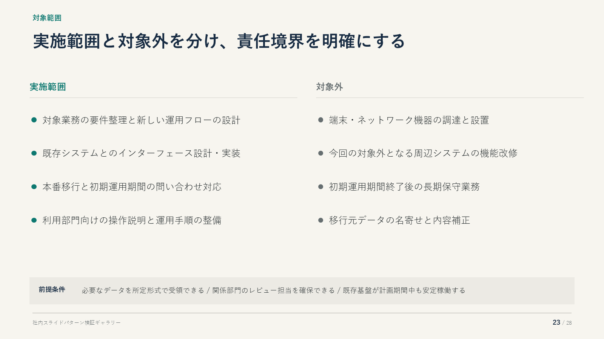
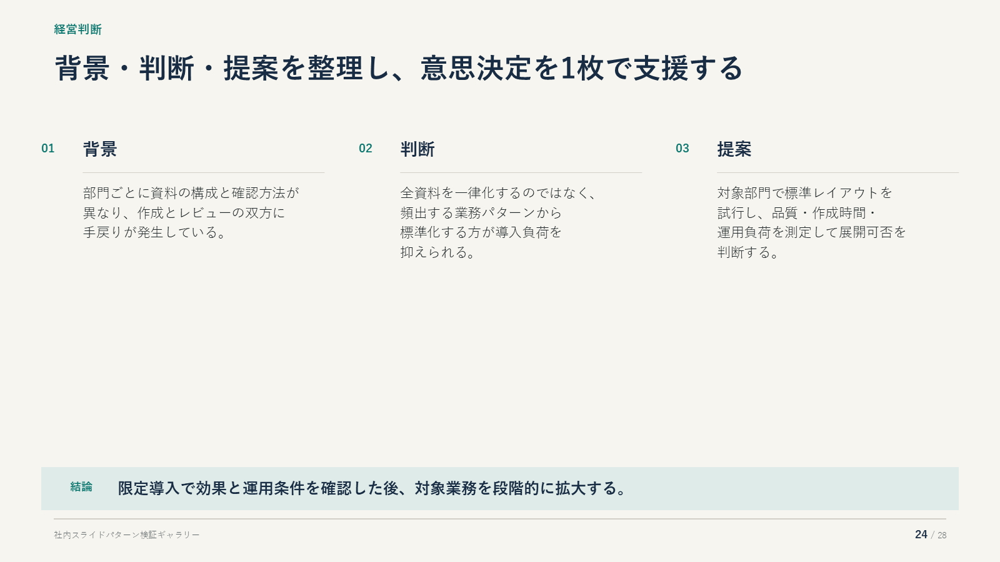
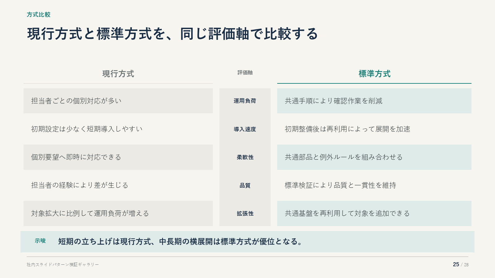
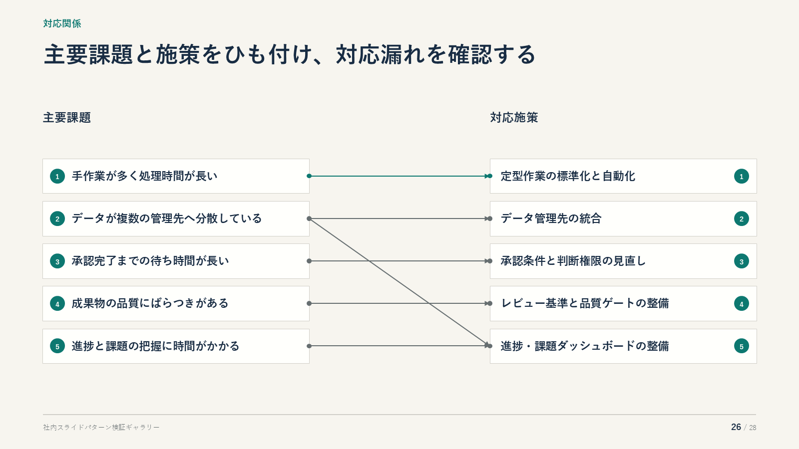
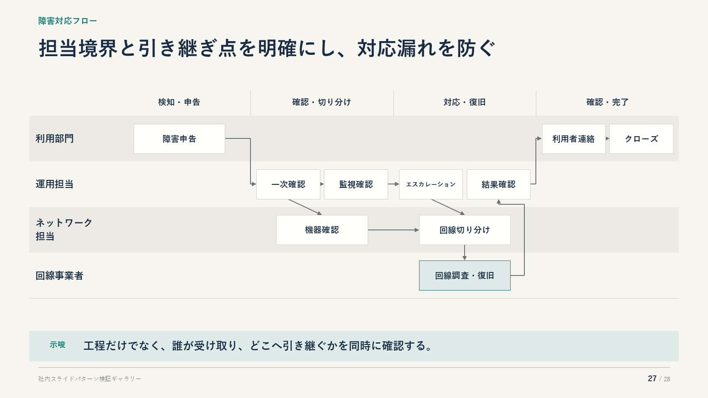

# 追加スライドパターン候補

6種類のrenderer候補を同じテーマで比較するための目視確認資料。
採否はPPTXと次のPowerPointレンダー画像を確認して判断する。

## scope

実施範囲、対象外、成立に必要な前提条件を整理する。

## summary

2〜4個の論点と最終判断を1枚に要約する。

## paired_comparison

2案を共通の評価軸で1行ずつ比較する。

## mapping

左右項目の一対一・一対多・多対多の対応漏れを確認する。

## swimlane

担当レーン、工程段階、引き継ぎを同時に確認する。

## sequence

関係者・機器間のメッセージを実行順に確認する。

