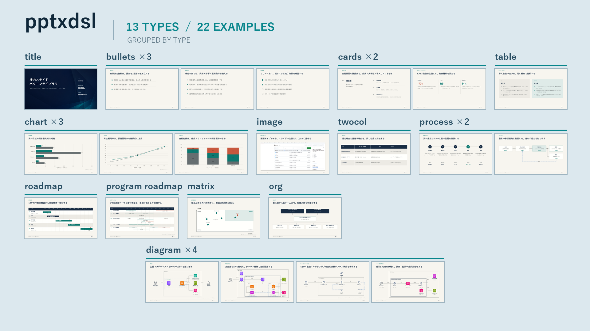

# サンプルスライドギャラリー

[pattern_gallery.pptx](pattern_gallery.pptx)は、cloneした利用者が対応レイアウトの見た目を
PowerPointで確認するための配布用ギャラリーです。



14種類のtypeを、23枚の出力例で比較できます。画像は全体確認用で、各スライドの文言、
図形、表、グラフ、配線は`pattern_gallery.pptx`で確認してください。

## 扱い

- 人間がレイアウト選定とデザイン確認に使う。
- 新しい資料を作る生成AIには渡さない。
- ギャラリーの題材、文言、数値、ページ順を`content.json`へ流用しない。
- rendererの開発時は、回帰検証と目視QAに使用する。

生成AIへ渡す資料は、記入済みの`AI_DECK_PROMPT.md`、`CONTENT_SCHEMA.md`、
`docs/type-selection-guide.md`です。

## 更新

renderer、テーマ、ギャラリー内容を変更した場合は、次のコマンドで配布用PPTXを更新します。

```powershell
python slidegen/generate_patterns.py examples\gallery\pattern_gallery.pptx
python slidegen/check_layout.py examples\gallery\pattern_gallery.pptx
powershell -ExecutionPolicy Bypass -File render.ps1 -PptxPath examples\gallery\pattern_gallery.pptx -OutDir out\png_pattern_gallery
python slidegen/build_gallery_overview.py out\png_pattern_gallery docs\pattern-gallery-by-type.png
```

各ページのPNGなど、配布しない確認用生成物は`out/`へ保存します。TYPE別一覧画像は
`docs/pattern-gallery-by-type.png`へ出力し、配布用PPTXと一緒に更新します。
